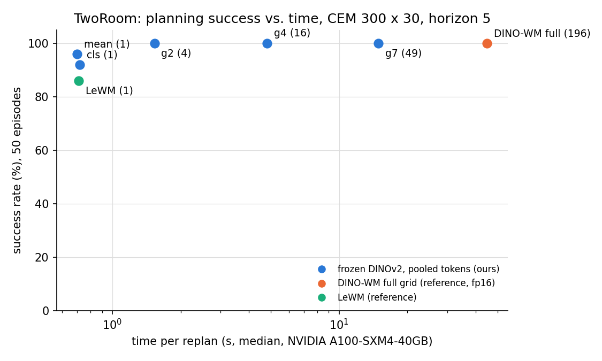

# dino-wm-tokens

**How many tokens does a frozen-DINO world model need?**

[DINO-WM](https://arxiv.org/abs/2411.04983) plans over a frozen DINOv2 patch grid (196 tokens per frame)
and is accurate but slow; [LeWM](https://arxiv.org/abs/2603.19312) plans over one learned vector and is
fast. This study keeps the frozen DINOv2 encoder, pools its patch grid to 1, 4, 16 or 49 tokens, retrains
only the predictor, and measures planning success against planning time under one pinned protocol.

Status: TwoRoom done; PushT, Reacher and Cube in progress.

## Result on TwoRoom



| model | tokens / frame | success (50 ep.) | s per replan (A100) |
|---|---|---|---|
| LeWM (reference) | 1 | 86% | 0.71 |
| pooled `cls` | 1 | 92% | 0.72 |
| pooled `mean` | 1 | 96% | 0.70 |
| pooled `g2` | 4 | 100% | 1.54 |
| pooled `g4` | 16 | 100% | 4.81 |
| pooled `g7` | 49 | 100% | 14.9 |
| DINO-WM full grid (reference, fp16) | 196 | 100% | 45.0 |

Four tokens reach the full grid's success at 29x less planning time; one-token models match LeWM's speed
at equal or better success. Same 50 start/goal queries, same CEM planner (300 samples, 30 iterations,
horizon 5) and the same GPU for every row.

Caveats: one seed (a difference of a few points is noise); the pooled models trained on 2,000 of 10,000
episodes for 30,000 steps; the DINO-WM reference is a third-party retrain with the official code, since
the original baseline checkpoints are no longer available; TwoRoom is a navigation task where even one
token may suffice, which is why the other environments follow.

## Method

- Encoder: DINOv2 ViT-S/14, frozen, fed exactly as the reference does (196 px, scaled to [-1, 1]).
- Pooling: CLS token, mean over patches, or adaptive average pooling of the 14 x 14 grid to 2 x 2,
  4 x 4, 7 x 7. Fixed, no learned parameters.
- Predictor: the reference's `CausalPredictor` (depth 6, 16 heads) at the reduced token count, trained
  with its recipe on cached features.
- Planning and evaluation: [stable-worldmodel](https://github.com/galilai-group/stable-worldmodel)'s
  CEM planner and dataset-driven evaluation, LeWM's protocol.

Details, measurements and pitfalls: [docs/NOTES.md](docs/NOTES.md). Design and hypotheses:
[docs/PLAN.md](docs/PLAN.md).

## Reproduce

```bash
pip install -e .
dwt run --env pusht            # references, features, train, evaluate, plot; see --help for stages and budgets
```

`STABLEWM_HOME` is the local data root, `DWT_PERSIST` an optional mirror that survives sessions (a Google
Drive folder on Colab), `DWT_RESULTS` the results folder. `notebooks/run_pipeline.ipynb` is a one-cell
launcher for Colab. Without a CUDA GPU, `dwt run --env tworoom --smoke` exercises every stage on a tiny
locally collected dataset.

The numbered notebooks in `notebooks/` are the TwoRoom run as it was done, stage by stage, with outputs.

## Layout

- `src/dwt/`: the pipeline (`envs` table, data, references, feature caching, training, evaluation, plots) and the pooled DINO-WM models.
- `results/`: `runs.csv` (one row per evaluation), pinned queries, training curves, figures, one episode
  video per reference model and for the 4-token model.
- `docs/`: implementation notes and study design.

## Credits

[stable-worldmodel](https://github.com/galilai-group/stable-worldmodel) and the
[LeWM](https://github.com/lucas-maes/le-wm) release (datasets, LeWM checkpoints);
[DINO-WM](https://github.com/gaoyuezhou/dino_wm); the DINO-WM checkpoints retrained by the authors of
[point-lewm](https://github.com/fafraob/point-lewm) (arXiv:2608.29434) and their planning adapter;
[DINOv2](https://github.com/facebookresearch/dinov2). Licenses: MIT, CC-BY-4.0 (retrained checkpoints),
Apache-2.0 (DINOv2).
