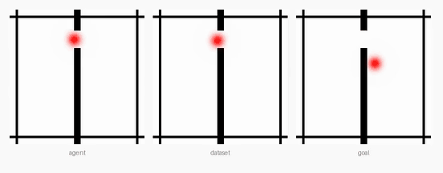
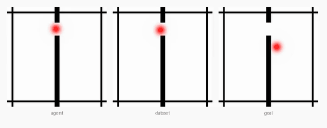
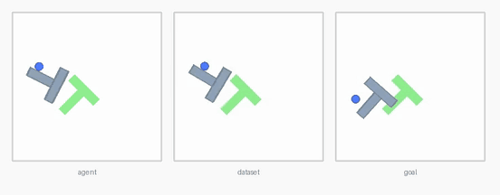
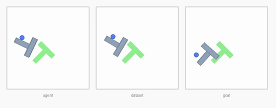
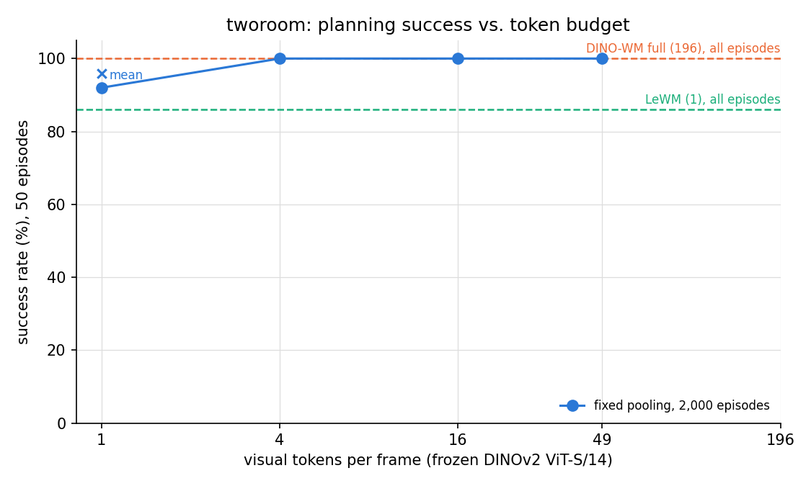
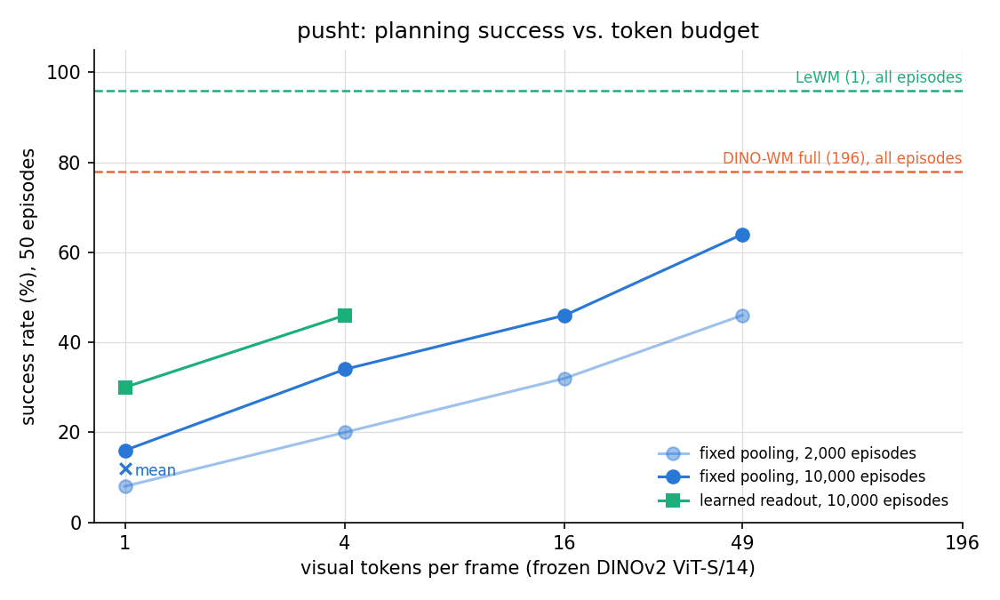

# dino-wm-tokens

**How many tokens does a frozen-DINO world model need?**

[DINO-WM](https://arxiv.org/abs/2411.04983) plans over a frozen DINOv2 patch grid of 196 tokens per
frame, while [LeWM](https://arxiv.org/abs/2603.19312) plans over a single learned vector and replans about
60 times faster. This study keeps the frozen DINOv2 encoder, reduces its grid to 1, 4, 16 or 49 tokens by
fixed pooling or by a small learned readout, retrains only the parts after the encoder, and measures
planning success against planning time under one pinned protocol on two environments.

| | LeWM, 1 learned token, 0.7 s per replan | frozen DINOv2, 4 tokens, 1.5 s per replan |
|---|---|---|
| TwoRoom |  |  |
| PushT |  |  |

The clips are example episodes from the pinned queries, with the same start and goal for both models in
each row. Each clip shows the episode executed by the planner on the left, the expert episode the query
was drawn from in the middle and the goal frame on the right. The right column shows the 2 x 2 pooled
model on TwoRoom and the four-token readout on PushT. Both models reach the goal on TwoRoom, and on PushT
LeWM reaches the goal pose in about half of the 50-step budget, while the readout rotates the block toward
the goal and ends the budget outside the success threshold.

## Findings

1. **On TwoRoom, four frozen tokens match the full grid** at 100% success in 1/29 of its planning time,
   and a single CLS or mean token reaches 92 and 96%, above LeWM's 86% at the same speed.
2. **On PushT, success increases with the token budget**, from 16% with one token to 34, 46, 64 and 78%
   with 4, 16, 49 and 196 tokens. This trend suggests that averaging patches discards information about
   the block's pose, which the planner needs to rank candidate actions.
3. **Increasing the training set from 2,000 to 10,000 episodes** narrowed the train/validation gap from
   3–4x to 1.2–1.5x and added 14 to 18 points for the 4-, 16- and 49-token grids and 8 points for the
   CLS token. The mean token gained nothing, which suggests that its ceiling is set by the pooling itself.
4. **A learned readout over the frozen tokens recovers part of this loss** at the same planning cost,
   reaching 30% with one token and 46% with four, so the four-token readout matches the 16-token grid in
   a third of its planning time. LeWM's single token, trained end to end on the target environment,
   remains 50 points ahead of the four-token readout at 96–98%.
5. **Validation MSE does not track planning success** across token budgets, since the mean token has both
   the lowest prediction error and the lowest success. One possible explanation is that the planner ranks
   candidate action sequences by distance in feature space, and a feature space that is easy to predict
   may still separate good plans from bad ones poorly.

| TwoRoom | PushT |
|---|---|
|  |  |

| PushT, A100 | tokens / frame | success (50 ep.) | s per replan |
|---|---|---|---|
| LeWM (reference) | 1 | 96–98% | 0.74 |
| pooled `cls` / `mean` | 1 | 16% / 12% | 0.70 |
| readout `r1` | 1 | 30% | 0.71 |
| pooled `g2` | 4 | 34% | 1.53 |
| readout `r4` | 4 | 46% | 1.54 |
| pooled `g4` | 16 | 46% | 4.79 |
| pooled `g7` | 49 | 64% | 14.8 |
| DINO-WM full grid (reference, fp16) | 196 | 78% | 45.0 |

| TwoRoom, A100 | tokens / frame | success (50 ep.) | s per replan |
|---|---|---|---|
| LeWM (reference) | 1 | 86% | 0.71 |
| pooled `cls` / `mean` | 1 | 92% / 96% | 0.71 |
| pooled `g2` | 4 | 100% | 1.54 |
| pooled `g4` | 16 | 100% | 4.81 |
| pooled `g7` | 49 | 100% | 14.9 |
| DINO-WM full grid (reference, fp16) | 196 | 100% | 45.0 |

Success plotted against time per replan is shown in the Pareto plots for
[TwoRoom](results/figures/pareto_tworoom.png) and [PushT](results/figures/pareto_pusht.png). Pooled models
were trained for 30,000 steps on 10,000 PushT or 2,000 TwoRoom episodes, and the references were trained
by their authors on all episodes. Every row uses the same 50 start/goal queries, the same CEM planner with
300 samples, 30 iterations and horizon 5, and the same GPU.

## Interpretation

The TwoRoom results suggest that, for a coarse navigation task, almost any summary of the frozen grid is
sufficient for planning. PushT depends on the pose of a block, and here averaging patches appears to
discard the information by which the planner ranks candidates. A learned readout recovers part of it
while keeping the encoder shared, so one DINOv2 forward pass could still serve other heads. LeWM's single
token likely works because its encoder was trained on the target environment, which makes it cheap to
plan with and to train, at the cost of retraining the encoder for every new environment.

| | encoder | planning cost | per-environment training | shared features |
|---|---|---|---|---|
| DINO-WM | frozen, universal | high (196 tokens) | predictor, heavy | yes |
| LeWM | trained per environment | low (1 token) | encoder + predictor, light | no |
| frozen + readout (this study) | frozen, universal | low (1–4 tokens) | readout + predictor, light | yes |

## Method

- Encoder: DINOv2 ViT-S/14, frozen, with the reference's preprocessing (196 px, scaled to [-1, 1]).
- Fixed pooling: CLS token, mean over patches, or adaptive average pooling of the 14 x 14 grid to 2 x 2,
  4 x 4, 7 x 7.
- Learned readout: k query tokens cross-attending to the pooled 7 x 7 tokens (Set Transformer /
  Perceiver-style pooling), trained jointly with the predictor under LeWM's objective (prediction MSE plus
  SIGReg against collapse).
- Predictor: the reference's `CausalPredictor` (depth 6, 16 heads) at the reduced token count, trained
  with the DINO-WM recipe on cached features.
- Planning and evaluation: [stable-worldmodel](https://github.com/galilai-group/stable-worldmodel)'s CEM
  planner and dataset-driven evaluation under LeWM's protocol, with 50 queries per environment, the goal
  25 steps ahead, a 50-step budget and seed 42.

## Limitations

- Each row comes from a single seed, so differences of a few points are within noise, as two LeWM runs on
  the same PushT queries gave 96 and 98%.
- The DINO-WM reference is a third-party retrain with the official code, since the original baseline
  checkpoints are no longer available, and it is evaluated in fp16 while all other models run in fp32.
- Pooled models were trained for 30,000 steps on half (PushT) or a fifth (TwoRoom) of the data, and the
  readouts were still improving at that budget.
- Only two of the four LeWM environments were evaluated, and Reacher and Cube are configured in
  `src/dwt/envs.py` without results.
- The readout attends to the pooled 7 x 7 tokens, and a readout over the full 196-token grid remains
  untested.

## Reproduction

```bash
pip install -e .
dwt run --env pusht --episodes 10000 --variants cls,mean,g2,g4,g7,r1,r4    # see --help for stages
```

`STABLEWM_HOME` is the local data root, `DWT_PERSIST` an optional mirror that survives sessions (a Google
Drive folder on Colab), `DWT_RESULTS` the results folder. `notebooks/run_pipeline.ipynb` is a one-cell
launcher for Colab. Without a CUDA GPU, `dwt run --env tworoom --smoke` exercises every stage on a tiny
locally collected dataset. The numbered notebooks in `notebooks/` document the original stage-by-stage
TwoRoom run, including outputs.

## Layout

- `src/dwt/`: the pipeline (`envs` table, data, references, feature caching, training, evaluation, plots)
  and the models (`PooledDino`, `ReadoutDino`).
- `results/`: `runs.csv` (one row per evaluation), pinned queries, training curves, figures, and the
  episode clips shown above (plus DINO-WM's TwoRoom episode).

## Credits

[stable-worldmodel](https://github.com/galilai-group/stable-worldmodel) and the
[LeWM](https://github.com/lucas-maes/le-wm) release (datasets, LeWM checkpoints, SIGReg);
[DINO-WM](https://github.com/gaoyuezhou/dino_wm); the DINO-WM checkpoints retrained by the authors of
[point-lewm](https://github.com/fafraob/point-lewm) (arXiv:2608.29434) and their planning adapter;
[DINOv2](https://github.com/facebookresearch/dinov2). The code and LeWM release are MIT-licensed, the
retrained DINO-WM checkpoints CC-BY-4.0 and DINOv2 Apache-2.0.
